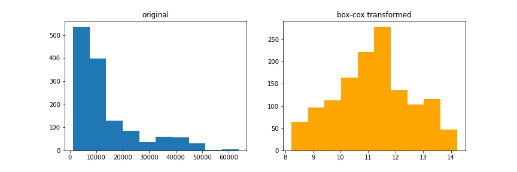
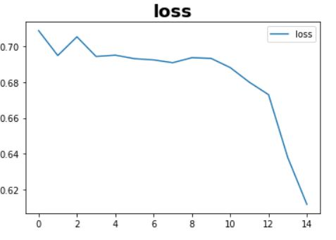
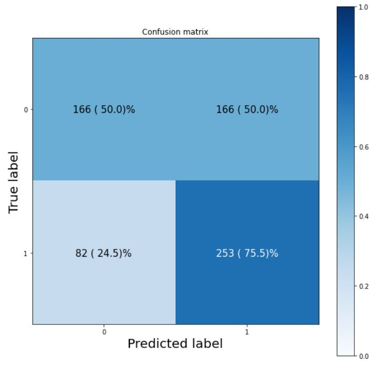
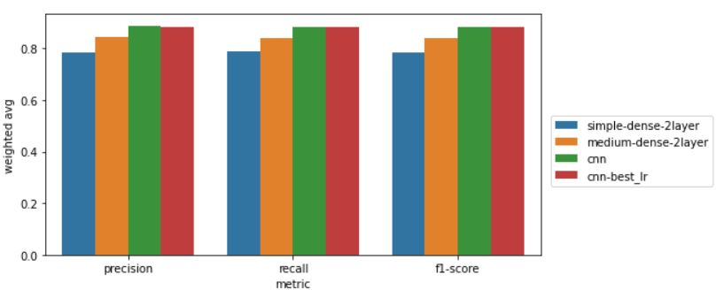

### Examples

## Fundamentals

### `Summarizing a tensor`

```python
import tensorflow as tf
from src.utils import describe_tensor

# set seed
tf.random.set_seed(42)

# make a random tensor
tensor = tf.random.normal(shape=(1, 3, 3))

# describe the tensor
describe_tensor(tensor)
```

```
Datatype: <dtype: 'float32'>
Number of dimensions: 3
Shape of tensor: (1, 3, 3)
Elements along the 0 axis: 1
Elements along the last axis: 3
Total number of elements: 9
```

```python
from src.utils import get_tensor_statistics

# get basic statistics of the tensor
get_tensor_statistics(tensor)
```
```
min: tf.Tensor(-2.3880599, shape=(), dtype=float32)
max: tf.Tensor(1.6994323, shape=(), dtype=float32)
mean: tf.Tensor(-0.3720852, shape=(), dtype=float32)
sum: tf.Tensor(-3.3487668, shape=(), dtype=float32)
std: tf.Tensor(1.1511972, shape=(), dtype=float32)
variance: tf.Tensor(1.325255, shape=(), dtype=float32)
```

## Neural Network Regression

### `PolynomialModel`

```python
import numpy as np
import matplotlib.pyplot as plt
from src.models import PolynomialModel

# input 1D feature
xmin, xmax = -10, 40 # range
m = 1000 # no of data points
X = np.expand_dims(np.linspace(xmin, xmax, m), axis=-1) # You can randomly sample as well

# polynomial model of any degree
quadmodel = PolynomialModel(params=[1, 2, -0.1], stderr=10)

# Now sample the targets
y = quadmodel(X, add_noise=True)

# Plot
fig, ax = plt.subplots()
ax.scatter(X.flatten(), y.flatten(), s=0.2, label='randomly sampled')
quadmodel.plot(X, ax=ax, label='True relationship')
ax.set(title='quadratic', xlabel='X', ylabel='y')
plt.legend()
```


### `OLSRegressor`

```python
from src.models import OLSRegressor
from sklearn.linear_model import LinearRegression

olsmodel = OLSRegressor(add_bias=True)
olsmodel.fit(np.hstack([X, X**2]), y)

linregmodel = LinearRegression()
linregmodel.fit(np.hstack([X, X**2]), y)

print('OLSRegressor results:\n----')
print(f'intercept: {olsmodel.intercept_[0]}, coefficients: {olsmodel.coef_}')
print('----\n')

print('LinearRegression results:\n----\n')
print(f'intercept: {linregmodel.intercept_}, coefficients: {linregmodel.coef_}')
print('----\n')
```

```
OLSRegressor results:
----
intercept: 1.2699100651176205, coefficients: [ 1.91208921 -0.09832959]
----

LinearRegression results:
----

intercept: 1.269910065117589, coefficients: [ 1.91208921 -0.09832959]
----
```

### `Quadratic Regression Model Comparison`


|Model   | Parameters  | RMSE |
|---|---|---|
|slr| 2| 23.92|
|single_layer| 49| 17.15|
|double_layer| 177| 17.24|
|polyfeat| 3| 15.27|
|true relationship| -| 15.11|

`polyfeat` was a simple linear regression model but with 2 degree polynomial features. This had the lowest number of parameters and also the lowest RMSE! Goes on to show the importance of feature engineering, and also kernel methods even for neural networks!

#### `Comparing Model Weights`

```python
from src.utils import check_tfmodels_weight_equality

# train model
model.fit(X, y)
# save model
model.save('model')
# load model
loaded_model = tf.keras.models.load_model('model')
# check if weights are equal
print(check_tfmodels_weight_equality(model, loaded_model))
```

```
True
```

### `BoxCoxTransformer`

```python
import pandas as pd
from src.preprocess import BoxCoxTransformer

df = pd.read_csv('../data/medical_cost/medical_cost.csv')
orig = df['charges'].to_numpy()

bctrans = bctrans = BoxCoxTransformer(alpha=0.05)
transformed = bctrans.fit_transform(orig)

fig, (ax1, ax2) = plt.subplots(1, 2, figsize=(12, 4))

ax1.hist(orig, bins=10)
ax1.set_title('original')
ax2.hist(transformed, bins=10,color='orange');
ax2.set_title('box-cox transformed');
```


## Neural Network Classification

### `TensorflowPlayground`

#### Features

A teeny tiny reimplementation of the https://playground.tensorflow.org/

* Start, pause, resume and reset training
    * Set max epochs
* Adjust Learning rate (+ Optimizer)
* Adjust activation (overall except last layer)
    * First layer activation option also
* Add Regularization (Overall all weights, [L1, L2])
    * Adjusting regularization rate
* Choose datasets - circle, exclusive_or, gaussian, spiral
    * Ratio of training to test data
    * Noise level
* Choose Features - X1, X2, X1_sq,X2_sq, X1X2, sin(X1), sin(X2)
* Choose architecture - no of hidden layers, no or neurons in each layer
* Monitor/Plot learning curves
* Monitor/Plot decision boundary
    * Option to show test data
    * Option to discretize output


`Setup your playground!`

```python
tfp = TensorflowPlayground(dataset='circle', 
                           features=['X1', 'X2'], 
                           neurons=[8, 4],
                           activation='sigmoid',
                           learning_rate=0.1,
                           scale=True)
```

`Plot the data!`

```python
tfp.data.plot()
```


`Train the model!`

```python
tfp.train(epochs=15, batch_size=30)
```
```
Epoch 1/15
12/12 [==============================] - 1s 3ms/step - loss: 0.7062
Epoch 2/15
12/12 [==============================] - 0s 3ms/step - loss: 0.6944
Epoch 3/15
12/12 [==============================] - 0s 3ms/step - loss: 0.7057
Epoch 4/15
12/12 [==============================] - 0s 3ms/step - loss: 0.6963
Epoch 5/15
12/12 [==============================] - 0s 3ms/step - loss: 0.6937
Epoch 6/15
12/12 [==============================] - 0s 3ms/step - loss: 0.6931
Epoch 7/15
12/12 [==============================] - 0s 3ms/step - loss: 0.6909
Epoch 8/15
12/12 [==============================] - 0s 3ms/step - loss: 0.6891
Epoch 9/15
12/12 [==============================] - 0s 3ms/step - loss: 0.6931
Epoch 10/15
12/12 [==============================] - 0s 3ms/step - loss: 0.6960
Epoch 11/15
12/12 [==============================] - 0s 5ms/step - loss: 0.6851
Epoch 12/15
12/12 [==============================] - 0s 3ms/step - loss: 0.6787
Epoch 13/15
12/12 [==============================] - 0s 3ms/step - loss: 0.6704
Epoch 14/15
12/12 [==============================] - 0s 3ms/step - loss: 0.6470
Epoch 15/15
12/12 [==============================] - 0s 3ms/step - loss: 0.6076
```
`Plot the learning curve!`

```python
tfp.plot_learning_curve();
```


``
`Plot the predictions`

```python
fig, axn = plt.subplots(1, 2, figsize=(12, 4))

for ax, subset in zip(axn, ['train', 'test']):
    cp = tfp.plot_decision_function(ax=ax)
    tfp.data.plot(subset=subset, ax=cp.axes)
    
    ax.set_title(subset, fontdict=dict(weight='bold', size=20))
    

fig.colorbar(cp);
```


`Analyze the peformance`

```python
tfp.plot_confusion_matrix();
```



### `Fashion MNIST`

```python
from tensorflow.keras.datasets import fashion_mnist

# The data has already been sorted into training and testing sets
(train_images, train_labels), (test_images, test_labels) = fashion_mnist.load_data()

# Name of the classes
class_names =  ['T-shirt/top', 'Trouser', 'Pullover', 'Dress', 'Coat',
               'Sandal', 'Shirt', 'Sneaker', 'Bag', 'Ankle boot']

n_classes = len(class_names)
```


Custom `ImageDataset`

```python
from src.image import ImageDataset

imgds = ImageDataset((train_images, train_labels), (test_images, test_labels), class_names)
```

Plot the label counts
```python
imgds.plot_labelcounts();
```


View random images
```python
imgds.view_random_images(class_names='all', n_each=2, subset='train');
```


Model Performance Comparison
```python
from src.evaluate import ClassificationPerformanceComparer

clf_comp = ClassificationPeformanceComparer(models, test_data)
clf_comp.calculate_metric_comparison_df()
clf_comp.plot_metric_comparison_df();
```
