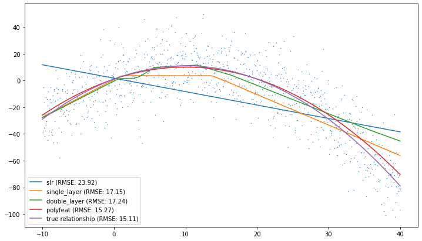

### Examples

## Fundamentals

### `Summarizing a tensor`

```python
import tensorflow as tf
from src.utils import describe_tensor

# set seed
tf.random.set_seed(42)

# make a random tensor
tensor = tf.random.normal(shape=(1, 3, 3))

# describe the tensor
describe_tensor(tensor)
```

```
Datatype: <dtype: 'float32'>
Number of dimensions: 3
Shape of tensor: (1, 3, 3)
Elements along the 0 axis: 1
Elements along the last axis: 3
Total number of elements: 9
```

```python
from src.utils import get_tensor_statistics

# get basic statistics of the tensor
get_tensor_statistics(tensor)
```
```
min: tf.Tensor(-2.3880599, shape=(), dtype=float32)
max: tf.Tensor(1.6994323, shape=(), dtype=float32)
mean: tf.Tensor(-0.3720852, shape=(), dtype=float32)
sum: tf.Tensor(-3.3487668, shape=(), dtype=float32)
std: tf.Tensor(1.1511972, shape=(), dtype=float32)
variance: tf.Tensor(1.325255, shape=(), dtype=float32)
```

## Neural Network Regression

### `PolynomialModel`

```python
import numpy as np
import matplotlib.pyplot as plt
from src.models import PolynomialModel

# input 1D feature
xmin, xmax = -10, 40 # range
m = 1000 # no of data points
X = np.expand_dims(np.linspace(xmin, xmax, m), axis=-1) # You can randomly sample as well

# polynomial model of any degree
quadmodel = PolynomialModel(params=[1, 2, -0.1], stderr=10)

# Now sample the targets
y = quadmodel(X, add_noise=True)

# Plot
fig, ax = plt.subplots()
ax.scatter(X.flatten(), y.flatten(), s=0.2, label='randomly sampled')
quadmodel.plot(X, ax=ax, label='True relationship')
ax.set(title='quadratic', xlabel='X', ylabel='y')
plt.legend()
```


### `OLSRegressor`

```python
from src.models import OLSRegressor
from sklearn.linear_model import LinearRegression

olsmodel = OLSRegressor(add_bias=True)
olsmodel.fit(np.hstack([X, X**2]), y)

linregmodel = LinearRegression()
linregmodel.fit(np.hstack([X, X**2]), y)

print('OLSRegressor results:\n----')
print(f'intercept: {olsmodel.intercept_[0]}, coefficients: {olsmodel.coef_}')
print('----\n')

print('LinearRegression results:\n----\n')
print(f'intercept: {linregmodel.intercept_}, coefficients: {linregmodel.coef_}')
print('----\n')
```

```
OLSRegressor results:
----
intercept: 1.2699100651176205, coefficients: [ 1.91208921 -0.09832959]
----

LinearRegression results:
----

intercept: 1.269910065117589, coefficients: [ 1.91208921 -0.09832959]
----
```

### `Quadratic Regression Model Comparison`



|Model   | Parameters  | RMSE |
|---|---|---|
|slr| 2| 23.92|
|single_layer| 49| 17.15|
|double_layer| 177| 17.24|
|polyfeat| 3| 15.27|
|true relationship| -| 15.11|

`polyfeat` was a simple linear regression model but with 2 degree polynomial features. This had the lowest number of parameters and also the lowest RMSE! Goes on to show the importance of feature engineering, and also kernel methods even for neural networks!

#### `Comparing Model Weights`

```python
from src.utils import check_tfmodels_weight_equality

# train model
model.fit(X, y)
# save model
model.save('model')
# load model
loaded_model = tf.keras.models.load_model('model')
# check if weights are equal
print(check_tfmodels_weight_equality(model, loaded_model))
```

```
True
```

### `BoxCoxTransformer`

```python
import pandas as pd
from src.preprocess import BoxCoxTransformer

df = pd.read_csv('../data/medical_cost/medical_cost.csv')
orig = df['charges'].to_numpy()

bctrans = bctrans = BoxCoxTransformer(alpha=0.05)
transformed = bctrans.fit_transform(orig)

fig, (ax1, ax2) = plt.subplots(1, 2, figsize=(12, 4))

ax1.hist(orig, bins=10)
ax1.set_title('original')
ax2.hist(transformed, bins=10,color='orange');
ax2.set_title('box-cox transformed');
```


